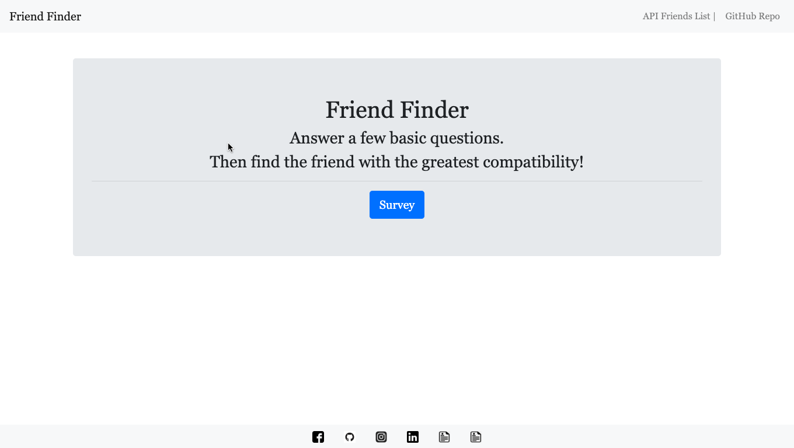
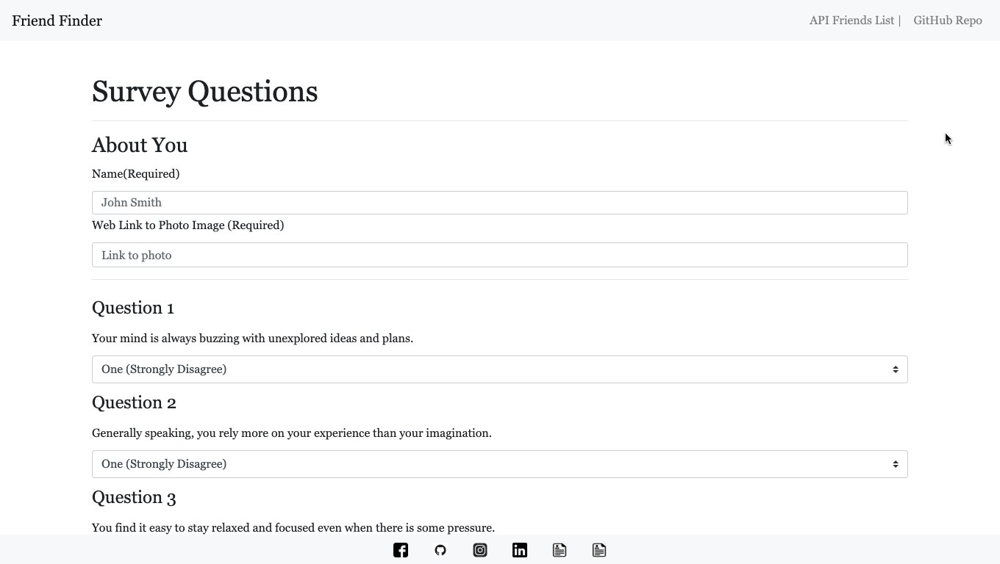
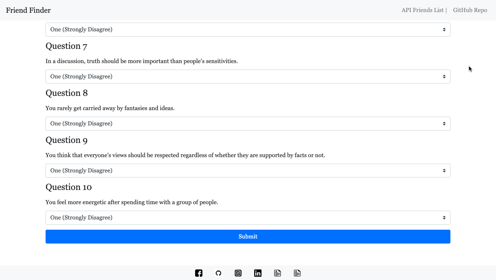
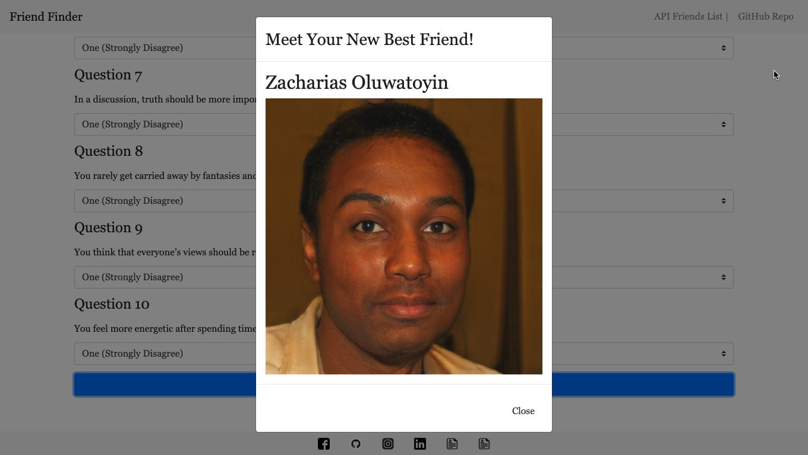
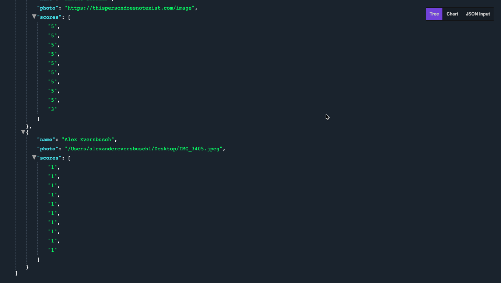

# Friend Finder - Online Dating App

An online dating app simulator. Take the survey, and then see who your closest match is. Your scores will be compared to the scores of all other participants in the survey. 

## Getting Started

Please install all dependencies needed to run this program. You should only need to navigate to the root of the project directory and run npm install in your terminal. 

## Deployment

This app was deployed using heroku.
https://desolate-beach-63395.herokuapp.com/

## Built With

* [Bootstrap](https://getbootstrap.com/docs/4.3/getting-started/introduction/)
* [jQuery](https://api.jquery.com/)
* [Node.js](https://nodejs.org/en/docs/)
* [Express.js](https://expressjs.com/en/starter/installing.html)

## Authors

* **Alex Eversbusch** 

## Version

V1.0

## Shout Outs!
Random Friend Name and Image Generation From https://thispersondoesnotexist.com/

## Screenshots
## Home Page

## Survey Page

## Survey Submit

## Results Modal

## API Link

